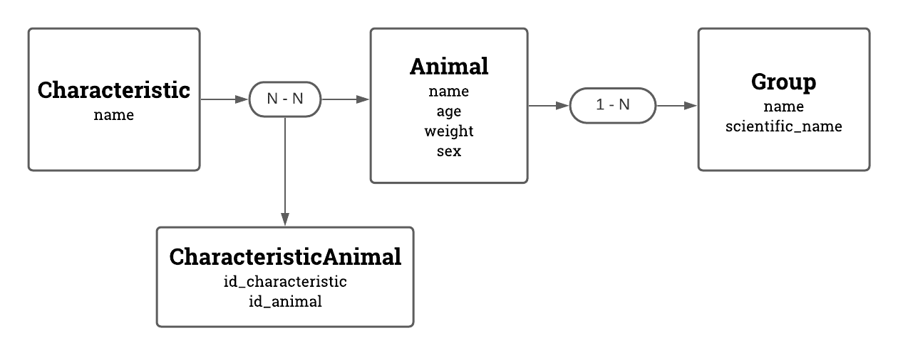

# KENZIE PET

## 1 - Diagrama ENTIDADE RELACIONAMENTO
</br>

</br>

## 2 - ANIMAIS

### 2.1 - POST `api/animais/`

```json REQUEST
  {
    "name": "Bidu",
    "age": 1,
    "weight": 30,
    "sex": "macho",
    "group": {
      "name": "cao",
      "scientific_name": "canis familiaris"
    },
    "characteristics": [
      {
        "name": "peludo"
      },
      {
        "name": "medio porte"
      }
    ]
  }
}
```

```json RESPONSE STATUS -> HTTP 201
  {
    "id": 1,
    "name": "Bidu",
    "age": 1.0,
    "weight": 30.0,
    "sex": "macho",
    "group": {
      "id": 1,
      "name": "cao",
      "scientific_name": "canis familiaris"
    },
    "characteristics": [
      {
        "id": 1,
        "name": "peludo"
      },
      {
        "id": 2,
        "name": "medio porte"
      }
    ]
  }

```

### 2.2 - GET `api/animais/`

```json RESPONSE STATUS -> HTTP 200
  [
    {
      "id": 1,
      "name": "Bidu",
      "age": 1,
      "weight": 30,
      "sex": "macho",
      "group": {
        "id": 1,
        "name": "cao",
        "scientific_name": "canis familiaris"
      },
      "characteristics": [
        {
          "id": 1,
          "name": "peludo"
        },
        {
          "id": 2,
          "name": "medio porte"
        }
      ]
    },
    {
      "id": 2,
      "name": "Hanna",
      "age": 1,
      "weight": 20,
      "sex": "femea",
      "group": {
        "id": 2,
        "name": "gato",
        "scientific_name": "felis catus"
      },
      "characteristics": [
        {
          "id": 1,
          "name": "peludo"
        },
        {
          "id": 3,
          "name": "felino"
        }
      ]
    }
  ]

```

### 2.3 - GET POR ID  `api/animais/<int:animal_id>/`

```json RESPONSE STATUS -> HTTP 200
  {
    "id": 1,
    "name": "Bidu",
    "age": 1,
    "weight": 30,
    "sex": "macho",
    "group": {
      "id": 1,
      "name": "cao",
      "scientific_name": "canis familiaris"
    },
    "characteristics": [
      {
        "id": 1,
        "name": "peludo"
      },
      {
        "id": 2,
        "name": "medio porte"
      }
    ]
  }
```

### 2.4 DELETE `api/animals/<int:animal_id>/`

```json
RESPONSE STATUS -> HTTP 204 (no content)
```
